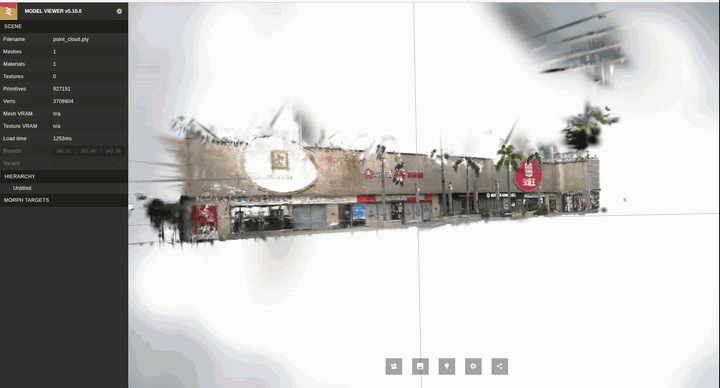
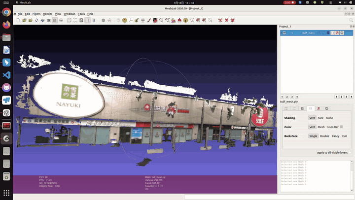

# Gaussian-LIC-ROS2

Gaussian-LIC 的 **ROS 2 Humble 社区移植版**：将 Coco-LIC/R3LIVE 前端与 Gaussian-LIC 高斯建图接入 ROS 2，并提供 FAST-LIVO2 bag 转换和 TSDF 网格导出。本仓库并非 [Gaussian-LIC 原项目](https://github.com/APRIL-ZJU/Gaussian-LIC)的官方 ROS 2 版本；尚未验证与 ROS 1 实现数值完全一致。

> 运行需要 NVIDIA GPU、匹配的 CUDA/TensorRT 环境及自行获取的模型权重。本仓库不提供数据集、权重、TensorRT engine 或运行结果。

## 效果展示

下面左右对比展示高斯建图结果与 TSDF 三角网格结果：

<table>
  <tr>
    <td align="center"><strong>Retail Street 高斯建图</strong></td>
    <td align="center"><strong>Retail Street TSDF 网格</strong></td>
  </tr>
  <tr>
    <td></td>
    <td></td>
  </tr>
</table>

## 项目结构

```text
Gaussian-LIC-ROS2/
├── gaussian_lic/             # 高斯建图 ROS 2 包：源码、配置、launch、模型说明与工具
├── third_party/
│   ├── cocolic_ros2/         # LIC/R3LIVE ROS 2 前端
│   └── cocolic_interfaces/   # Livox 与前端消息定义
├── scripts/                  # ROS 1 bag 转换及回归检查
├── env.sh                    # Conda 依赖安装及终端环境设置
├── colcon_defaults.yaml      # 构建默认参数
└── THIRD_PARTY.md            # 第三方来源与许可
```

`build/`、`install/`、`log/`、`result/` 是本地生成目录，不需要上传 GitHub。

## 环境与构建

已适配的组合：Ubuntu 22.04 x86_64、ROS 2 Humble、CUDA Toolkit 12.6、TensorRT 10.7、Python 3.10、PyTorch 2.7.1（CUDA 12.6）。先安装 NVIDIA 驱动和 Conda，并配置 ROS 2 / NVIDIA 软件源；脚本不安装驱动，也不配置软件源。其他版本组合未经验证；TensorRT engine 必须针对目标 GPU 和运行时构建。

在仓库根目录执行：

```bash
bash env.sh                 # 安装默认 Conda 环境
bash env.sh --check         # 可选：检查依赖
bash env.sh --dry-run       # 可选：预览安装命令
# 仅在 ROS 2 / NVIDIA apt 软件源已配置、需要安装系统依赖时：
bash env.sh --system
```

默认 Conda 环境名为 `gaussian_lic_ros2`，可通过 `GAUSSIAN_ENV_NAME` 修改；安装、激活时须使用同一名称。`--system` 会调用 `sudo apt-get`，运行前先核对 `env.sh` 中的依赖列表。

### 模型文件

按 [`gaussian_lic/ckpt/README.md`](gaussian_lic/ckpt/README.md) 获取 SPNet `Large_300.pth` 并在目标机器上生成 `spnet_512_640.engine`、`spnet_480_640.engine`；LPIPS 评估还需要 `gaussian_lic/src/lpips/lpips_alex.pt`。这些文件不会自动下载，也不提交到 Git。**先准备模型，再构建工作空间**：

```bash
source ./env.sh
bash gaussian_lic/ckpt/export_onnx.sh
bash gaussian_lic/ckpt/build_trt.sh
# LPIPS 权重获取方法见 gaussian_lic/ckpt/README.md
colcon build
source install/setup.bash
```

每个新终端都在仓库根目录执行 `source ./env.sh`；启动 ROS 2 节点前还需 `source install/setup.bash`。ROS 2 使用系统 Python；bag 转换、ONNX 和 Open3D 工具使用 `"$CONDA_PREFIX/bin/python"`。若构建后才补充模型，需再次运行 `colcon build`。

## 快速开始：Retail Street

### 1. 转换 FAST-LIVO2 ROS 1 bag

```bash
source ./env.sh
"$CONDA_PREFIX/bin/python" scripts/fastlivo2_to_ros2.py /path/to/Retail_Street.bag
# 可选第二参数：输出目录；默认输出至 bag 同目录下的 Retail_Street_ros2
```

转换器保留 topic、时间戳和可映射的字段；将 `livox_ros_driver` / `livox_ros_driver2` 的自定义消息转换为 `cocolic_interfaces` 消息。它不会自动适配标定或话题名；输出目录已存在时不会覆盖。其他自定义消息仍需消费端提供相应 ROS 2 接口。ROS 1 `Header.seq` 在 ROS 2 中无对应字段。

### 2. 启动建图后端

终端 A（仓库根目录）：

```bash
source ./env.sh
source install/setup.bash
ros2 launch gaussian_lic fastlivo2.launch.py result_path:="$PWD/result/Retail_Street/map"
```

### 3. 启动离线前端

后端就绪后，在终端 B（仓库根目录）：

```bash
source ./env.sh
source install/setup.bash
mkdir -p result/Retail_Street
ros2 launch cocolic_ros2 cocolic_original.launch.py \
  bag_path:=/absolute/path/to/Retail_Street_ros2 \
  bag_start:=0.0 bag_duration:=-1.0 \
  trajectory_output:="$PWD/result/Retail_Street/trajectory"
```

前端直接读取 bag，**不要同时运行 `ros2 bag play`**。默认配置使用 `/livox/imu`、`/livox/lidar`、`/left_camera/image`；更换数据集时需检查前后端话题和相机内外参。兼容入口 `cocolic_real_odometry.launch.py` 启动同一原始算法节点。

等待建图端输出 `Gaussian-LIC Done!`，表示队列处理、评估与保存结束。**每次运行使用新的 `result_path`**：评估阶段会重建该路径下的输出目录，不要指向已有重要文件。

结果包括 `point_cloud.ply`（高斯参数）、`render/`、`render_depth/`、`gt/`、`keyframe_selection.csv` 和前端轨迹。高斯 PLY 不是三角网格，渲染深度可视化也不能直接作为米制深度参与 TSDF 融合。

## 可选：TSDF 三角网格

复制 `gaussian_lic/config/fastlivo2.yaml`，在副本中将 `tsdf_export` 设为 `true`；用**绝对路径**通过建图 launch 的 `config_path` 传入。以下建图命令**替代**上文终端 A 的命令，不要启动两个后端：

```bash
ros2 launch gaussian_lic fastlivo2.launch.py \
  config_path:=/absolute/path/to/fastlivo2_tsdf.yaml \
  result_path:="$PWD/result/Retail_Street/map_tsdf"
```

再启动上文终端 B 的前端。运行完成后，会在 `<result_path>_tsdf_input` 目录生成关键帧的米制深度、RGB、内参与位姿：

```bash
"$CONDA_PREFIX/bin/python" gaussian_lic/scripts/fuse_tsdf_mesh.py \
  result/Retail_Street/map_tsdf_tsdf_input \
  --output result/Retail_Street/tsdf_mesh.ply \
  --voxel 0.04 --truncation 0.16 --depth-trunc 20 --min-cluster-triangles 200
```

生成的三角网格可用 MeshLab、CloudCompare 或 Open3D 打开；高斯 splat 查看器不能将其作为高斯模型加载。TSDF 融合不反向优化高斯参数。

## 其他数据集与自检

`gaussian_lic/config/` 还包含 M3DGR、MT 及原始数据集配置。`m3dgr.launch.py` 将已有 Odometry / PoseStamped 与整数深度转换为后端输入，**不估计里程计**；`m3dgr_grass01_avia.launch.py` 只启动后端，依赖外部前端发布对应 `/..._for_gs` 话题。不能直接套用 Retail Street 的标定。

```bash
ros2 run gaussian_lic inspect_m3dgr_avia_projection.py /path/to/Grass01_ros2
"$CONDA_PREFIX/bin/python" scripts/test_fastlivo2_converter.py
/usr/bin/python3 gaussian_lic/tests/test_dataset_tools.py
```

## 运行记录

在 RTX 4060 Laptop（8 GB 显存）、16 GB 内存和 18 GiB swap 上，一次 135.47 秒的 Retail Street bag 完整运行产生 1,288 帧建图输入、200 个关键帧和 927,695 个高斯，总耗时 271.19 秒。前端从打开 bag 到完成为 116.40 秒，后端核心优化累计 202.33 秒；两阶段重叠，不能相加。非训练视角 PSNR / SSIM / LPIPS 为 23.89 / 0.764 / 0.125。**这只是一次实测，不保证性能或与 ROS 1 数值等价**；完整运行可能需要较多内存和 swap。

## 许可与上传 GitHub

本仓库基于 [Gaussian-LIC](https://github.com/APRIL-ZJU/Gaussian-LIC) 及其组件移植，原始版权声明予以保留。`LICENSE` 提供 GPL v3 正文，但**不代表所有第三方组件均可按 GPL 重新授权**
